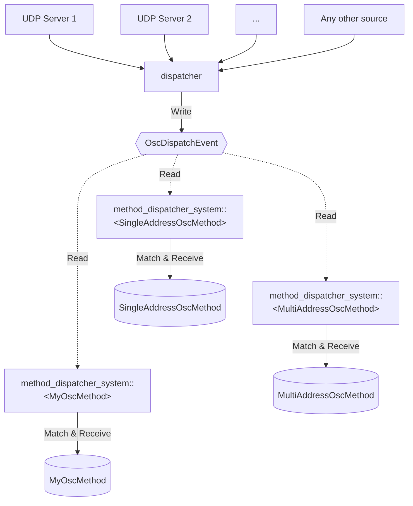

# bevy_rosc

[](https://github.com/bevyengine/bevy/blob/main/docs/plugins_guidelines.md#main-branch-tracking)
[](https://crates.io/crates/bevy_rosc)
[](https://docs.rs/bevy_rosc)

Send and receive [OSC 1.0](https://github.com/CNMAT/OpenSoundControl.org/blob/master/spec-1_0.md) messages in bevy with [rosc](https://github.com/klingtnet/rosc).

## Usage

To quickly get started just add the plugin to your app:

```rust
use bevy::prelude::*;

use bevy_rosc::OscMethod;
use bevy_rosc::{BevyRoscPlugin, SingleAddressOscMethod};

fn main() {
    App::new()
        // Minimal Bevy plugins
        .add_plugins(MinimalPlugins)
        // Add the bevy_rosc plugin and have it listen on port 31337
        .add_plugin(BevyRoscPlugin::new("0.0.0.0:31337").unwrap())
        .run();
}
```

Now you can add just add `SingleAddressOscMethod` or  `MultiAddressOscMethod` to your entities.

OSC methods are components that have one or more OSC address and can receive OSC messages that have a matching address pattern.

```rust
fn spawn_entity(mut commands: Commands) {
    commands.
        spawn()
        .insert(
            SingleAddressOscMethod::new(vec!["/some/osc/address".into()]).unwrap()
        );
}
```

Then you can start retrieving OSC messages from the component!

```rust
/// System that listens for any `SingleAddressOscMethod` that has changed and prints received message
fn print_received_osc_packets(
    mut query: Query<&mut SingleAddressOscMethod, Changed<SingleAddressOscMethod>>,
) {
    for mut osc_receiver in query.iter_mut() {
        let new_msg = osc_receiver.get_message(); // Gets the oldest received message, or `None` if there are no more left
        if let Some(msg) = new_msg { println!("Method {:?} received: {:?}", osc_receiver.get_addresses(), msg) }
    }
}
```

See [examples/plugin.rs](examples/plugin.rs) for a full example.

If you want to receive OSC messages directly into your custom component, see [examples/custom_osc_method.rs](examples/custom_osc_method.rs)

## Data flow


Any OSC packet that was received by any means (usually a UDP server) is sent to the dispatcher.
It unpacks the OSC packet, retrieves all messages from it and writes an `OscDispatchEvent` containing them.
From there, the method dispatcher system (One for each `OscMethod`-component) reads the event and iterates over all OSC method components.
If the component's address matches the message's address pattern, the message is received by the component.

The default OSC methods `SingleAddressOscMethod` and `MultiAddressOscMethod` will just store the received message in a vector, from which you have to retrieve them to do anything with them.
Your custom OSC component however can directly act on receiving the messages.

## Bevy Compatibility

| bevy | bevy_rosc |
|------|-----------|
| 0.8  | 0.4       |
| 0.7  | 0.1       |